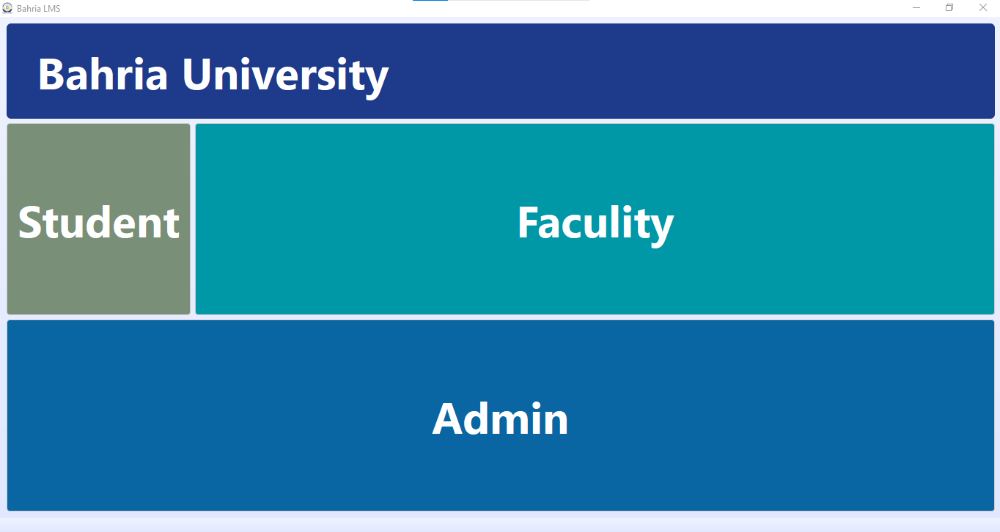
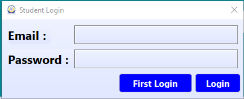
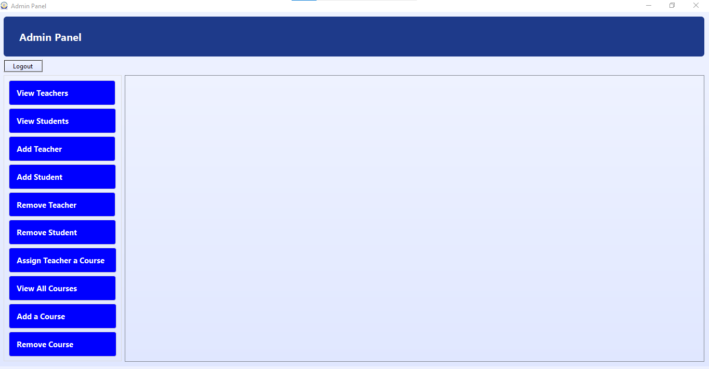
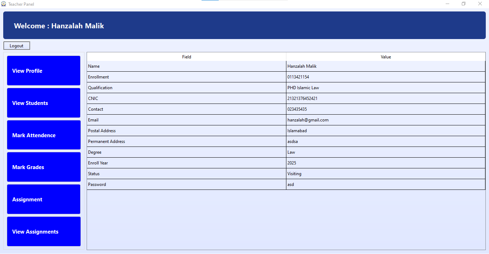
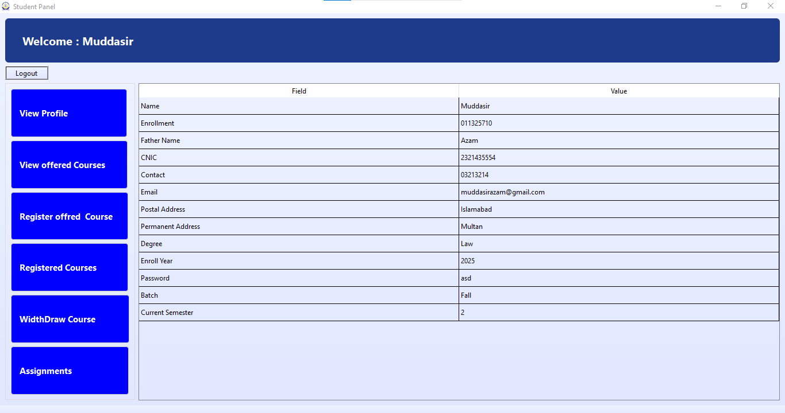
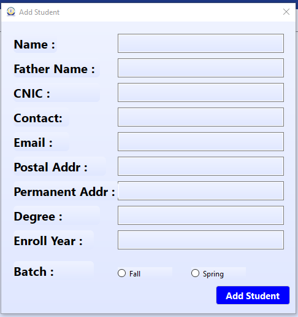

# 🚀 Learning Management System Project

---

# 📌 Project Overview

This repository contains an **Object-Oriented Programming (OOP) project** created to demonstrate core OOP concepts using structured programming techniques.

The project focuses on building a system using **classes and objects** while applying important OOP principles such as **Encapsulation, Inheritance, Polymorphism, and Abstraction**.

---

# 🧠 OOP Concepts Used

| Concept | Description |
|------|------|
| Encapsulation | Wrapping data and methods together |
| Inheritance | Reusing existing classes |
| Polymorphism | Multiple forms of functions |
| Abstraction | Hiding complex logic |

---

# ⚙️ Features

✔ Object-Oriented design  
✔ Clean and modular code  
✔ Real-world problem simulation  
✔ Easy to maintain and extend  

---

# 🛠 Technologies Used

- Programming Language: **C++ / QTFramework**
- IDE: **QT Creator**
- Version Control: **GitHub**

---

# ▶️ How to Run

### Clone the Repository

git clone https://github.com/MuddasirAzam-065/Object-Oriented-Programming-Project.git.

Note: You would have to require a qt frame work in order to run and see implementation of code.

The default username and passowrd for admin is [admin:admin]

Where as this project runs on your local machine creating a .csv file for each operation, and accessing when required.

The passwrod of teacher and student, is set after the admin adds them. As it runs on a local machine so at first their is no teacehr or student.

---

# 🖥️Bugs and Enhancement:

✔ First of all the program runs on a local machine which limits the data only to a single machine gnerally admin

✔ It can be integrated to a live databsae such as firebase or mongodb so it can be used within all members of college

✔ API such as Twilio Verify or Plivo Verify can be used to send otp to reset password

---

# 📸 GUI of the Porject

### Main Interface

### Login interface

### Admin's Panel Interface

### Teacher's Panel Interface

### Student's Panel Interface[

### Adding Interface[

# 📚 Learning Outcomes

This project helped improve:

- Object-Oriented Programming skills
- Code organization
- Software design
- Git & GitHub workflow

---

# 👨‍💻 Author

**Muddasir Azam**

GitHub  
https://github.com/MuddasirAzam-065

---

# ⭐ Support

If you like this project please give it a **star ⭐**

---

# 📄 License

This project is for **educational purposes**.
